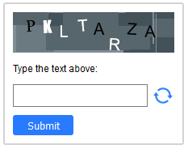

# Captcha Generator

HTML5 & Javascript captcha generator using a HTML canvas to produce the captcha on the frontend. 

To implement, just add the script at the end of the body of the page you intend to use it on and then
just drop the following tag into your HTML.

```html
<captcha></captcha>
```

If successful you should see the captcha window rendered - see example below.



